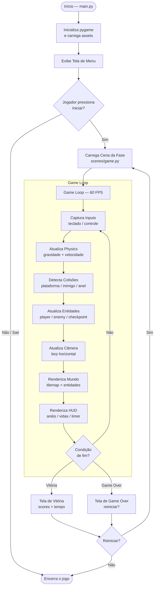
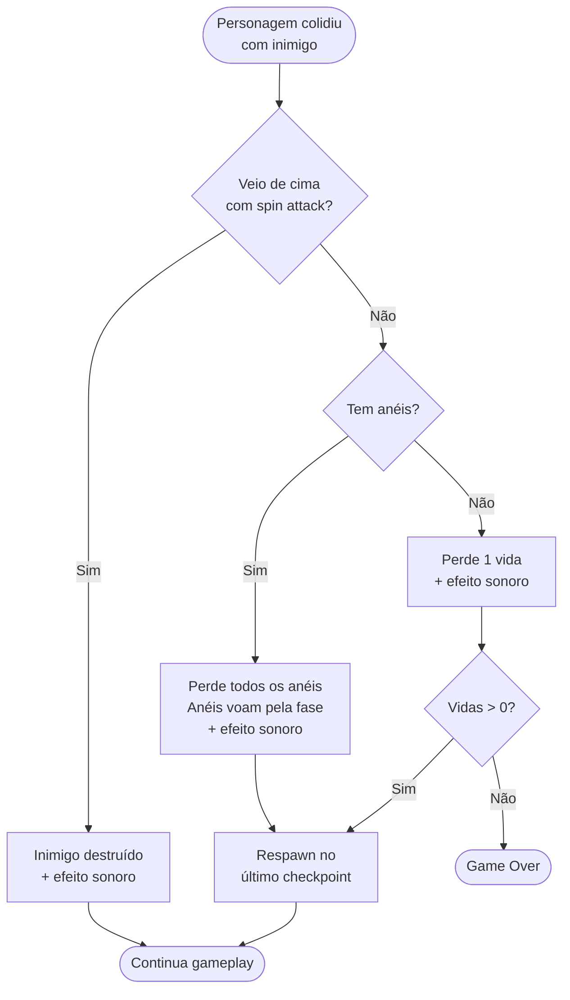
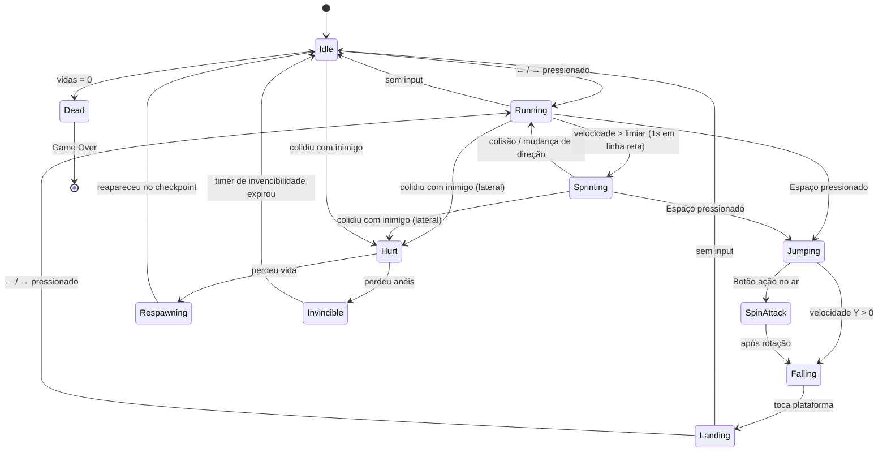
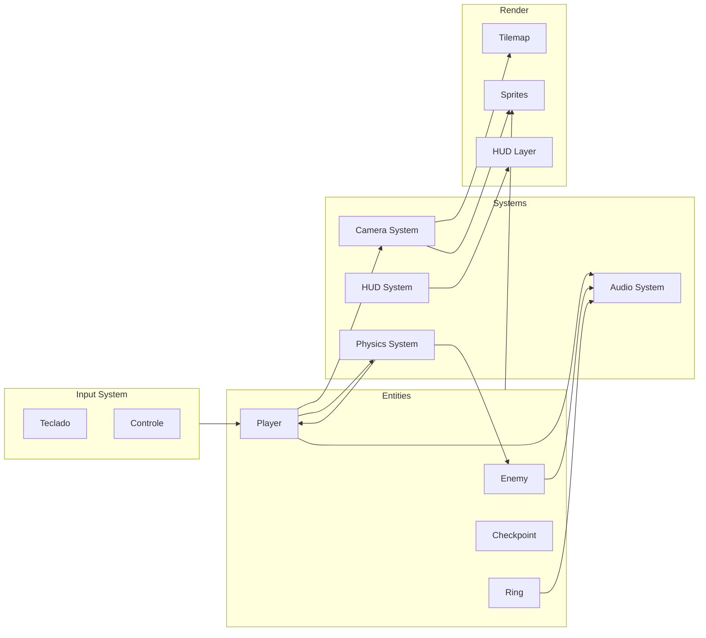
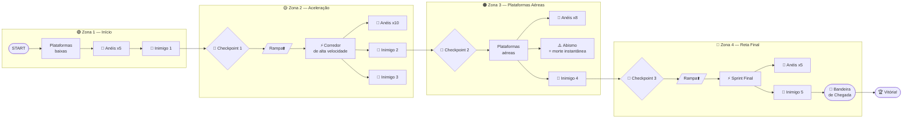
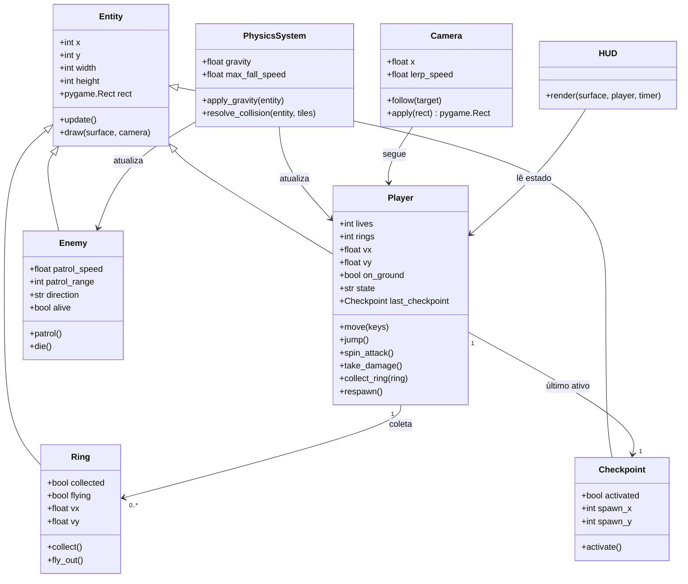
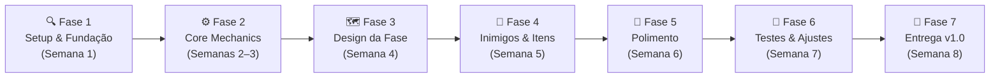

# PyBlaze — PRD v1.0

> Jogo de plataforma 2D de alta velocidade inspirado no Sonic the Hedgehog, desenvolvido em Python com uma fase jogável completa.

---

## Metadados

| Campo       | Valor                          |
|-------------|--------------------------------|
| Produto     | PyBlaze                        |
| Versão      | 1.7.1                          |
| Data        | 2026-03-28                     |
| Autor       | Agente de Produto — IA         |
| Status      | **Lançado**                    |
| Tipo        | Jogo Desktop (App Python)      |

---

## 1. Visão Geral e Problema

### Contexto e Motivação

Jogos de plataforma 2D são uma categoria atemporal e amplamente amada. Projetos educacionais e portfólios de desenvolvedores Python carecem de exemplos completos, funcionais e bem estruturados de jogos deste gênero. O PyBlaze nasce como referência técnica e produto jogável.

### Problema

Desenvolvedores Python iniciantes e intermediários não têm um exemplo de referência de jogo de plataforma 2D com mecânicas de alta velocidade, código organizado e bem documentado. Os tutoriais existentes são fragmentados e não entregam um produto completo.

### Oportunidade

Criar um jogo completo, jogável e com uma fase polida que sirva simultaneamente como produto de entretenimento e como referência de boas práticas de desenvolvimento de jogos em Python com `pygame`.

---

## 2. Objetivos e Não-Objetivos

### ✅ IN SCOPE — O que esta versão faz

- Personagem principal controlável com movimentação de alta velocidade
- Uma fase completa com início, meio e fim (bandeira de chegada)
- Sistema de coleta de itens (anéis/orbs)
- Inimigos com comportamento básico de patrulha
- Sistema de dano e respawn do personagem
- Câmera que acompanha o personagem horizontalmente
- Tela de início, tela de game over e tela de vitória
- HUD com contador de itens, vidas e timer
- Trilha sonora e efeitos sonoros básicos
- Loop de física: gravidade, pulo, colisão com plataforma

### ✅ NOVOS RECURSOS (v1.7.1)

- **Sistema de Save/Load** - Progresso salvo automaticamente
- **Sistema de Configuração** - 20+ variáveis via `.env`
- **Performance Monitor** - Métricas em tempo real (FPS, update, render)
- **Analytics Local** - Rastreamento de gameplay (privado)
- **Docker Support** - Containerização completa
- **60 testes automatizados** - 69% de cobertura
- **Pre-commit hooks** - Qualidade garantida
- **CI/CD completo** - GitHub Actions + Dependabot

### ❌ OUT OF SCOPE — O que esta versão NÃO faz

- Múltiplas fases ou mundo mapa
- Multiplayer local ou online
- Loja ou sistema de personalização
- Boss ao final da fase
- Suporte mobile
- Editor de fases

---

## 3. Personas e Usuários

| Persona             | Perfil                                                       | Necessidade                                         | Dor atual                                              |
|---------------------|--------------------------------------------------------------|-----------------------------------------------------|--------------------------------------------------------|
| **Jogador Casual**  | 15–35 anos, gosta de jogos rápidos, sessões curtas           | Uma fase divertida e desafiadora para jogar agora   | Jogos indie incompletos, bugs e falta de polimento     |
| **Dev Estudante**   | Desenvolvedor Python aprendendo pygame ou game dev           | Código de referência bem organizado e documentado   | Tutoriais fragmentados que não chegam a um produto     |
| **Dev Portfólio**   | Dev Python que quer um projeto visual para mostrar           | Projeto completo, funcional e visualmente atraente  | Exemplos genéricos, sem identidade visual ou gameplay  |

---

## 4. Requisitos Funcionais

### Personagem Principal

| ID    | Requisito                                                                                    | Prioridade      |
|-------|----------------------------------------------------------------------------------------------|-----------------|
| RF01  | O personagem deve se mover para esquerda e direita com aceleração progressiva                | Must Have       |
| RF02  | O personagem deve pular (pressão curta = pulo baixo; pressão longa = pulo alto)              | Must Have       |
| RF03  | O personagem deve acumular velocidade ao correr em linha reta por mais de 1 segundo          | Must Have       |
| RF04  | O personagem deve executar spin attack ao apertar o botão de ação durante o pulo             | Should Have     |
| RF05  | O personagem deve perder anéis ao ser atingido (e não vidas, se tiver pelo menos 1 anel)     | Must Have       |
| RF06  | O personagem perde uma vida ao ser atingido sem nenhum anel                                  | Must Have       |
| RF07  | Ao perder vida, o personagem reaparece no checkpoint mais próximo                            | Must Have       |

### Fase e Mundo

| ID    | Requisito                                                                                    | Prioridade      |
|-------|----------------------------------------------------------------------------------------------|-----------------|
| RF08  | A fase deve ter extensão horizontal de pelo menos 5x a largura da tela                      | Must Have       |
| RF09  | A fase deve conter plataformas em diferentes alturas                                         | Must Have       |
| RF10  | A fase deve conter rampas que aumentam a velocidade do personagem                            | Should Have     |
| RF11  | A fase deve conter loops (tubos circulares percorridos em alta velocidade)                   | Nice to Have    |
| RF12  | A fase deve ter pelo menos 2 checkpoints além do início e do fim                             | Must Have       |
| RF13  | A fase deve terminar ao tocar a bandeira/poste de chegada                                   | Must Have       |
| RF14  | Anéis/orbs devem estar distribuídos ao longo da fase em posições fixas                      | Must Have       |

### Inimigos

| ID    | Requisito                                                                                    | Prioridade      |
|-------|----------------------------------------------------------------------------------------------|-----------------|
| RF15  | Inimigos do tipo "patrulheiro" devem andar para frente e para trás em uma plataforma        | Must Have       |
| RF16  | Inimigos devem ser destruídos com spin attack vindo de cima                                  | Must Have       |
| RF17  | Inimigos devem causar dano ao toque lateral ou frontal                                       | Must Have       |

### Interface e HUD

| ID    | Requisito                                                                                    | Prioridade      |
|-------|----------------------------------------------------------------------------------------------|-----------------|
| RF18  | HUD deve exibir: contador de anéis, vidas restantes e tempo decorrido                       | Must Have       |
| RF19  | Tela de início deve exibir nome do jogo e opção de "Iniciar" e "Sair"                        | Must Have       |
| RF20  | Tela de game over deve exibir pontuação final e opção de reiniciar                          | Must Have       |
| RF21  | Tela de vitória deve exibir anéis coletados, tempo final e uma mensagem de parabéns          | Must Have       |

### Câmera e Áudio

| ID    | Requisito                                                                                    | Prioridade      |
|-------|----------------------------------------------------------------------------------------------|-----------------|
| RF22  | A câmera deve seguir o personagem horizontalmente com suavização (lerp)                     | Must Have       |
| RF23  | Efeitos sonoros devem tocar para: pulo, coleta de anel, dano, morte e vitória               | Should Have     |
| RF24  | Música de fundo deve tocar em loop durante a fase                                            | Should Have     |

---

## 5. Requisitos Não-Funcionais

| ID     | Requisito                                                                          | Detalhe                                   |
|--------|------------------------------------------------------------------------------------|-------------------------------------------|
| RNF01  | **Performance** — framerate estável                                                | 60 FPS constantes em hardware médio       |
| RNF02  | **Tempo de inicialização**                                                         | Jogo deve carregar em menos de 3 segundos |
| RNF03  | **Compatibilidade**                                                                | Windows, Linux e macOS via Python 3.11+   |
| RNF04  | **Dependências mínimas**                                                           | Apenas `pygame-ce` como dep principal     |
| RNF05  | **Código organizado**                                                              | Separação por módulos (entities, scenes, systems) |
| RNF06  | **Sem crashes**                                                                    | Zero exceções não tratadas durante o gameplay |
| RNF07  | **Resolução padrão**                                                               | 1280×720 (HD), janela redimensionável     |

---

## 6. Arquitetura e Funcionamento

### Visão geral dos módulos

```
pyblaze/
├── main.py                 # Entry point e game loop
├── settings.py             # Constantes globais (FPS, resolução, cores)
├── assets/                 # Sprites, sons, tiles
├── scenes/
│   ├── menu.py             # Tela inicial
│   ├── game.py             # Cena principal da fase
│   └── gameover.py         # Tela de game over / vitória
├── entities/
│   ├── player.py           # Personagem principal
│   ├── enemy.py            # Inimigo patrulheiro
│   ├── ring.py             # Item coletável
│   └── checkpoint.py       # Ponto de respawn
├── systems/
│   ├── physics.py          # Gravidade, colisão, velocidade
│   ├── camera.py           # Câmera com lerp horizontal
│   └── hud.py              # Renderização do HUD
└── utils/
    ├── spritesheet.py      # Carregamento de spritesheets
    └── tilemap.py          # Carregamento e renderização do mapa
```

### Fluxo principal do Game Loop



### Fluxo de colisão e dano do personagem



### Estados do Personagem (State Machine)



### Arquitetura de sistemas



### Layout da Fase — Mapa Conceitual



### Diagrama de Classes — Entidades Principais



---

## 7. Plano de Implementação



### Detalhamento das fases

| Fase | Entregáveis                                                                                 |
|------|---------------------------------------------------------------------------------------------|
| 1    | Repositório criado, estrutura de pastas, `pygame` rodando com janela 1280×720, 60 FPS       |
| 2    | Player se move, pula, tem física (gravidade + colisão com chão), câmera acompanha           |
| 3    | Tilemap da fase carregado, plataformas, rampas, checkpoints e bandeira de fim               |
| 4    | Inimigos patrulhando, anéis distribuídos, sistema de dano e respawn funcionando             |
| 5    | Sprites animados, HUD completo, telas de menu/gameover/vitória, áudio                       |
| 6    | Testes de gameplay, ajuste de velocidade/dificuldade, bug fixing                            |
| 7    | Build final, README, release no GitHub                                                      |

---

## 8. Métricas de Sucesso (KPIs)

| Métrica                        | Baseline | Meta       | Como medir                                     |
|--------------------------------|----------|------------|------------------------------------------------|
| FPS médio durante gameplay     | —        | ≥ 58 FPS   | `pygame.time.Clock` + log de frames            |
| Tempo médio para completar fase | —        | 3–5 min    | Timer interno registrado na tela de vitória    |
| Taxa de crashes em playtest    | —        | 0 crashes  | Sessões de teste sem exceção não tratada        |
| Tempo de carregamento inicial  | —        | < 3 seg    | Medido com `time.perf_counter` no startup       |
| Cobertura de testes unitários  | —        | ≥ 70%      | `pytest --cov` nos sistemas de physics e lógica |
| Feedback positivo em playtest  | —        | ≥ 80%      | Formulário pós-playtest com 5+ testers          |

---

## 9. Riscos e Dependências

### Riscos

| Risco                                         | Probabilidade | Impacto | Mitigação                                                            |
|-----------------------------------------------|---------------|---------|----------------------------------------------------------------------|
| Performance abaixo de 60 FPS em PCs mais fracos | Média       | Alto    | Profiling com `cProfile` + otimizar renderização de tilemap (dirty rects) |
| Física de colisão com bugs em alta velocidade | Alta          | Alto    | Implementar swept AABB collision desde o início                       |
| Escopo crescente (loop, boss, múltiplas fases) | Alta         | Médio   | Congelar escopo na Fase 3 e mover extras para v2.0                   |
| Assets sem licença livre                      | Baixa         | Alto    | Usar apenas assets CC0 (OpenGameArt.org) ou criar próprios           |
| Compatibilidade multiplataforma               | Baixa         | Médio   | Testar em Windows, Linux e macOS desde a Fase 1                      |

### Dependências

| Dependência         | Tipo     | Detalhe                                               |
|---------------------|----------|-------------------------------------------------------|
| `pygame-ce >= 2.4`  | Externa  | Engine de renderização e input                        |
| Python `>= 3.11`    | Runtime  | Tipagem moderna e performance                         |
| Assets CC0          | Conteúdo | Sprites de personagem, tiles e sons (OpenGameArt.org) |
| Tiled Map Editor    | Ferramenta | Criação do tilemap da fase (exporta `.tmx`)          |
| `pytmx`             | Externa  | Carregamento de mapas `.tmx` do Tiled                 |

---

## 10. Critérios de Aceite

| ID    | Critério                                                                                         |
|-------|--------------------------------------------------------------------------------------------------|
| CA01  | O jogo inicia sem erros e exibe a tela de menu em menos de 3 segundos                           |
| CA02  | O personagem se move, pula e acumula velocidade corretamente em todas as plataformas            |
| CA03  | A câmera acompanha o personagem sem cortes ou glitches visuais                                  |
| CA04  | Ao colidir com inimigo sem anéis, o personagem perde uma vida e reaparece no checkpoint         |
| CA05  | Ao colidir com inimigo com anéis, os anéis voam pela fase e podem ser recoletados               |
| CA06  | Inimigo é destruído ao receber spin attack vindo de cima                                        |
| CA07  | A fase possui início, checkpoints, inimigos, anéis e bandeira de fim funcionando               |
| CA08  | A tela de vitória exibe anéis coletados e tempo final                                           |
| CA09  | A tela de game over permite reiniciar a fase                                                    |
| CA10  | O jogo roda a ≥ 58 FPS em uma máquina com CPU dual-core e 4GB RAM                              |
| CA11  | Nenhuma exceção não tratada ocorre em uma sessão completa de gameplay (do menu ao fim da fase)  |
| CA12  | O projeto roda com `python main.py` após `uv sync` ou `pip install -r requirements.txt`         |

---

## Glossário

| Termo            | Definição                                                                               |
|------------------|-----------------------------------------------------------------------------------------|
| **Tilemap**      | Grade de tiles (blocos pequenos) que compõe o cenário da fase                          |
| **Sweep AABB**   | Técnica de detecção de colisão que previne o personagem de "atravessar" objetos         |
| **Lerp**         | Interpolação linear — suaviza o movimento da câmera entre a posição atual e a alvo     |
| **Spin Attack**  | Ataque giratório do personagem no ar, usado para destruir inimigos                     |
| **Checkpoint**   | Ponto salvo na fase onde o personagem reaparece ao morrer                               |
| **Game Loop**    | Loop principal do jogo: captura inputs → atualiza estado → renderiza → repete a 60 FPS |
| **HUD**          | Head-Up Display — interface sobreposta ao jogo (vidas, anéis, timer)                   |
| **CC0**          | Creative Commons Zero — licença de domínio público, sem restrições de uso              |
| **dirty rects**  | Técnica de renderização que atualiza apenas regiões alteradas da tela, otimizando FPS  |