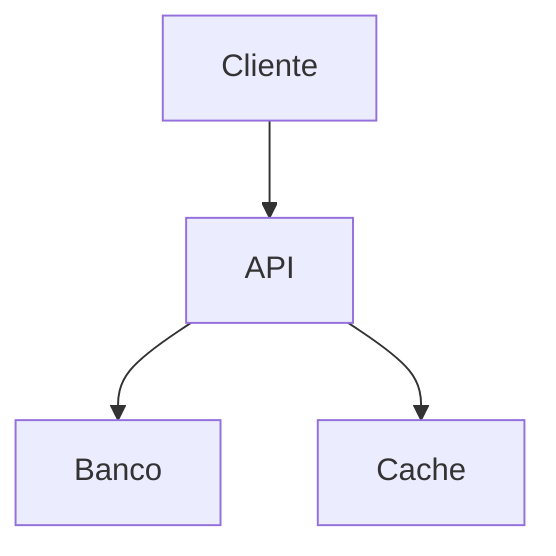
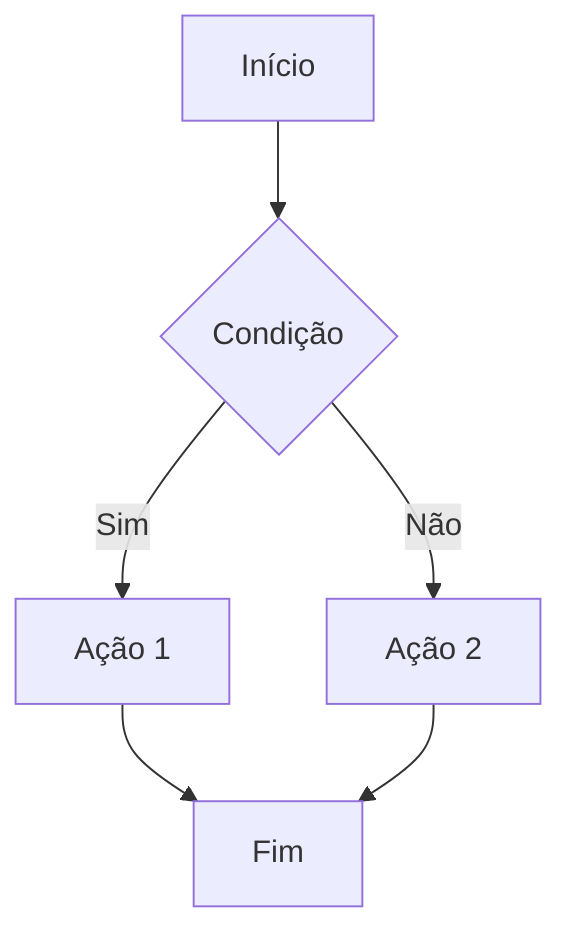
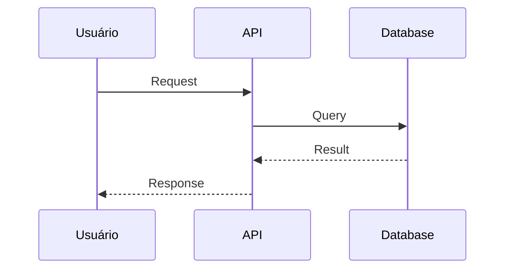
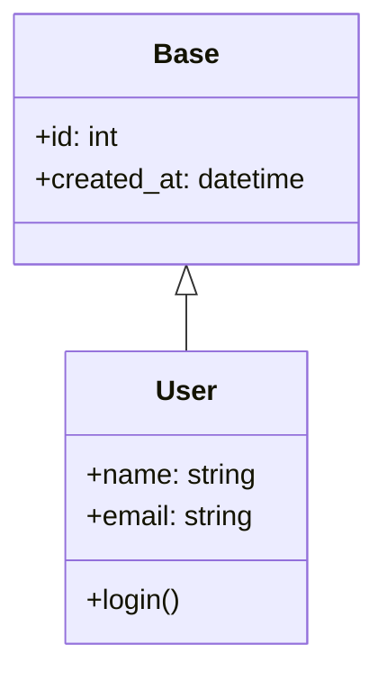
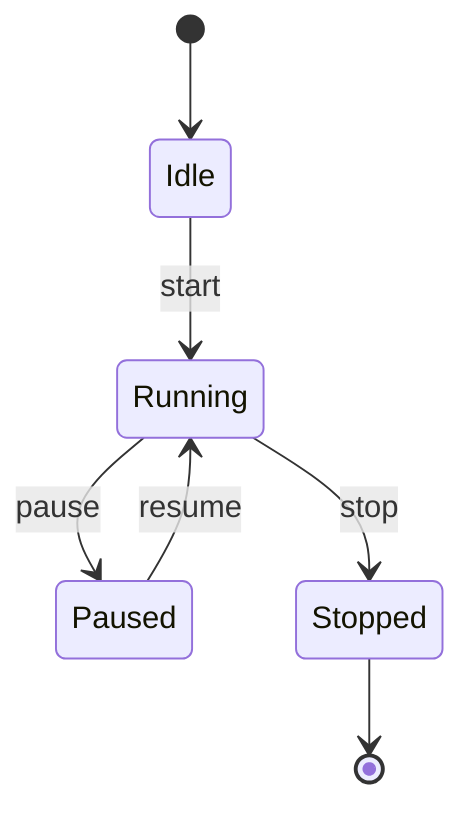
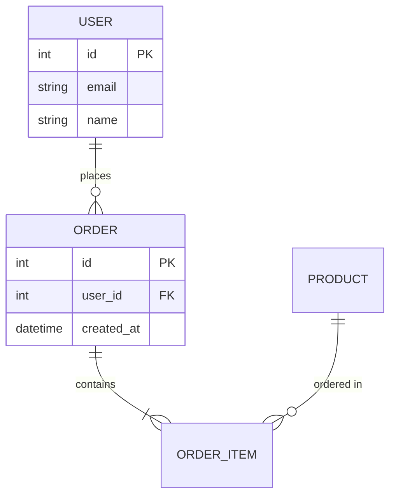
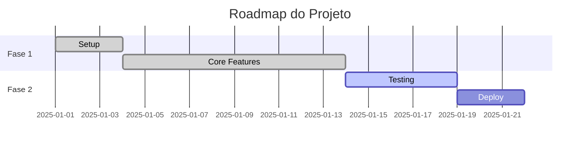
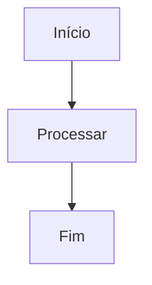
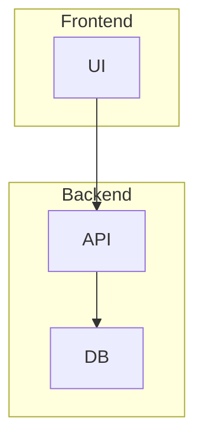

# Guideline: Como Escrever Documentação

> Padrões e boas práticas para documentação completa de projetos - README, guides, specs e documentação técnica

---

## 📋 Índice

1. [Princípios Fundamentais](#princípios-fundamentais)
2. [README.md](#readmemd)
3. [Documentação Técnica](#documentação-técnica)
4. [Guias e Tutoriais](#guias-e-tutoriais)
5. [Especificações (Specs)](#especificações-specs)
6. [Changelog e Histórico](#changelog-e-histórico)
7. [Diagramas Mermaid](#diagramas-mermaid)
8. [Boas Práticas Gerais](#boas-práticas-gerais)
9. [Checklist de Qualidade](#checklist-de-qualidade)

---

## 🎯 Princípios Fundamentais

### 1. **Documentação em Português**
- ✅ TODO o conteúdo deve estar em português brasileiro
- ✅ Termos técnicos podem ficar em inglês (ex: commit, merge, deploy)
- ✅ Nomes de tecnologias mantêm grafia original (ex: Python, Docker, pytest)
- ❌ Nunca misture idiomas em uma mesma seção

### 2. **Clareza e Objetividade**
- Seja direto ao ponto
- Use exemplos práticos e executáveis
- Evite jargões desnecessários
- Assuma conhecimento técnico básico do leitor

### 3. **Consistência**
- Mantenha o mesmo tom de voz em toda documentação
- Use a mesma estrutura para documentos similares
- Padronize nomenclatura (ex: "usuário" vs "user")
- Mantenha formatação consistente

### 4. **Manutenibilidade**
- Documente decisões arquiteturais importantes
- Mantenha docs atualizadas com o código
- Use links relativos para arquivos do projeto
- Versione suas documentações importantes

---

## 📄 README.md

O README é a porta de entrada do projeto. Deve responder rapidamente:
- O que é este projeto?
- Como eu começo a usar?
- Onde encontro mais informações?

### Estrutura Obrigatória

#### 1. **Título e Descrição**
```markdown
# Nome do Projeto

<div align="center">


</div>

Breve descrição (1-2 linhas) do que o projeto faz e qual tecnologia principal usa.
```

#### 2. **Características Principais**
```markdown
## Características

- ✅ Feature implementada com descrição breve
- ✅ Outra feature importante
- ⚠️ Feature em desenvolvimento
- Sistema completo de X com Y e Z
```

#### 3. **Requisitos**
```markdown
## Requisitos

- Python 3.12+
- uv 0.4+ (gerenciador de pacotes)
- Outras ferramentas necessárias
```

#### 4. **Instalação**
```markdown
## Instalação

### 1. Instalar pré-requisitos

**macOS / Linux:**
```bash
curl -LsSf https://astral.sh/uv/install.sh | sh
```

**Windows:**
```powershell
powershell -c "irm https://astral.sh/uv/install.ps1 | iex"
```

### 2. Clonar e configurar

```bash
git clone https://github.com/user/projeto.git
cd projeto
uv sync
```
```

#### 5. **Como Usar**
Adapte conforme o tipo de projeto:

**Para Jogos:**
```markdown
## Como Jogar

```bash
uv run python src/main.py
```

### Controles

**Menu:**
- `W/S` ou `↑/↓` - Navegar
- `Enter` - Selecionar

**Jogo:**
- `A/D` ou `←/→` - Mover
- `Espaço` - Pular
- `ESC` - Pausar
```

**Para APIs:**
```markdown
## Como Usar

### Iniciar servidor

```bash
uv run uvicorn src.main:app --reload
```

### Endpoints Principais

| Método | Endpoint | Descrição | Auth |
|--------|----------|-----------|------|
| POST | `/auth/login` | Login | Não |
| GET | `/tasks` | Listar tarefas | Sim |
| POST | `/tasks` | Criar tarefa | Sim |

### Exemplo de uso

```bash
curl -X POST http://localhost:8000/tasks \
  -H "Authorization: Bearer {token}" \
  -H "Content-Type: application/json" \
  -d '{"title": "Minha tarefa"}'
```
```

#### 6. **Desenvolvimento**
```markdown
## Desenvolvimento

### Comandos Rápidos

```bash
make help          # Ver todos comandos
make test          # Executar testes
make lint          # Verificar qualidade
make run           # Executar aplicação
```

### Comandos Manuais

```bash
# Testes
uv run pytest -v

# Type checking
uv run mypy src/

# Formatação
uv run ruff format src/ tests/

# Lint
uv run ruff check src/ tests/ --fix
```
```

#### 7. **Estrutura do Projeto**
```markdown
## Estrutura do Projeto

```
projeto/
├── src/                   # Código fonte
│   ├── entities/         # Entidades do sistema
│   ├── services/         # Lógica de negócio
│   └── utils/            # Utilitários
├── tests/                # Testes
├── docs/                 # Documentação
└── .kiro/               # Configurações do projeto
    ├── specs/           # Especificações
    └── steering/        # Guias e padrões
```

### Arquitetura

[Incluir diagrama Mermaid - ver seção específica]
```

#### 8. **Documentação Adicional**
```markdown
## Documentação

Para informações detalhadas, consulte:

- [Índice Completo](docs/INDEX.md)
- [Guia de Contribuição](docs/CONTRIBUTING.md)
- [Lições Aprendidas](docs/LESSONS_LEARNED.md)
- [Changelog](CHANGELOG.md)
```

#### 9. **Licença e Créditos**
```markdown
## Licença

Este projeto foi desenvolvido como material educacional.

## Créditos

Desenvolvido seguindo as melhores práticas de Python moderno.
```

---

## 📚 Documentação Técnica

Documentação técnica vive em `docs/` e fornece detalhes profundos.

### INDEX.md - Mapa da Documentação

O `docs/INDEX.md` é o índice geral de toda documentação:

```markdown
# Projeto - Índice de Documentação

> Documentação completa do projeto XYZ

---

## 📚 Visão Geral

Este diretório contém toda a documentação técnica, guidelines e especificações.

---

## 📖 Estrutura da Documentação

### 📄 Documentos Principais

- **[PROJETO_COMPLETO.md](PROJETO_COMPLETO.md)** - Resumo executivo
  - Status e entregas
  - Métricas e qualidade
  - Como executar
  - Arquitetura

### 🚀 Guias de Uso

- **[QUICK_REFERENCE.md](QUICK_REFERENCE.md)** - Comandos rápidos
  - Comandos mais usados
  - Atalhos úteis
  - Troubleshooting comum

### 💡 Conhecimento

- **[LESSONS_LEARNED.md](LESSONS_LEARNED.md)** - Problemas e soluções
  - Erros encontrados
  - Soluções aplicadas
  - Recomendações

### 🤝 Contribuição

- **[CONTRIBUTING.md](CONTRIBUTING.md)** - Como contribuir
  - Processo de desenvolvimento
  - Padrões de código
  - Templates de commits e PRs

---

## 🎯 Como Usar Esta Documentação

### Para Desenvolvedores
1. Comece pelo README.md
2. Leia PROJETO_COMPLETO.md para visão geral
3. Use QUICK_REFERENCE.md no dia-a-dia

### Para Contributors
1. Leia CONTRIBUTING.md
2. Consulte LESSONS_LEARNED.md
3. Siga os padrões em .kiro/steering/
```

### PROJETO_COMPLETO.md - Visão Geral

```markdown
# Projeto - Documento Completo

> Visão completa do projeto, arquitetura e entregas

---

## 📋 Resumo Executivo

[Descrição do projeto em 2-3 parágrafos]

### Status: ✅ CONCLUÍDO

---

## 🎯 O Que Foi Entregue

### ✅ Funcionalidades Principais

**Core:**
- Feature A com X, Y e Z
- Feature B integrada com C
- Sistema completo de D

**Qualidade:**
- N testes (100% passing)
- Type checking strict
- CI/CD automatizado

### ✅ Métricas

| Métrica | Valor | Status |
|---------|-------|--------|
| Testes | 26 | ✅ |
| Cobertura | 95% | ✅ |
| Type Check | 0 erros | ✅ |
| Lint | 0 warnings | ✅ |

---

## 🏗️ Arquitetura

[Diagrama Mermaid da arquitetura]

### Decisões Arquiteturais

#### Por que escolhemos X?
[Justificativa]

#### Como funciona Y?
[Explicação técnica]

---

## 📊 Como Executar

[Instruções detalhadas]

---

## 🔄 Roadmap

### Versão Atual (1.0)
- [x] Feature A
- [x] Feature B

### Próximas Versões
- [ ] Feature C
- [ ] Melhoria D
```

### QUICK_REFERENCE.md - Comandos Rápidos

```markdown
# Projeto - Referência Rápida

> Comandos e informações essenciais

---

## 🚀 Comandos Essenciais

### Setup Inicial
```bash
# Clone e configure
git clone <url>
cd projeto
uv sync
```

### Desenvolvimento
```bash
# Rodar aplicação
uv run python src/main.py

# Testes
uv run pytest

# Qualidade
uv run ruff check src/ --fix
uv run mypy src/
```

---

## 🎮 Controles / API / Como Usar

[Informações específicas do projeto]

---

## 📁 Estrutura Simplificada

```
src/
├── entities/    # O que são
├── systems/     # Para que servem
└── utils/       # Utilitários
```

---

## 🔧 Troubleshooting

### Problema X
```bash
# Solução
comando --fix
```

### Problema Y
[Explicação da solução]

---

## 💡 Dicas Rápidas

- Dica 1: Faça X para conseguir Y
- Dica 2: Use Z quando quiser W

---

**Mantenha esta página favoritada!** 📌
```

### LESSONS_LEARNED.md - Lições Aprendidas

```markdown
# Projeto - Lições Aprendidas

> Problemas encontrados e soluções aplicadas

---

## 1. [Categoria do Problema]

### ❌ Problema: [Descrição curta]
**Erro:** `Mensagem de erro exata`

**Causa:** Explicação da causa raiz

**✅ Solução:**
```python
# Código da solução
```

**Lição:** Aprendizado principal para evitar no futuro

---

## 2. [Próximo Problema]

[Mesmo formato...]

---

## 📊 Resumo de Lições

### Top 5 Problemas Mais Comuns
1. [Problema 1]
2. [Problema 2]
3. ...

### Principais Aprendizados
- Aprendizado 1
- Aprendizado 2
```

### CONTRIBUTING.md - Guia de Contribuição

```markdown
# Guia de Contribuição

> Como contribuir para o projeto

---

## 🚀 Como Começar

### 1. Fork e Clone
```bash
git clone <seu-fork>
cd projeto
```

### 2. Configurar Ambiente
```bash
uv sync
uv pip install -e .
```

### 3. Verificar Setup
```bash
make test
make run
```

---

## 💻 Processo de Desenvolvimento

### Workflow

1. **Criar Branch**
   ```bash
   git checkout -b feat/minha-feature
   ```

2. **Desenvolver**
   - Faça mudanças
   - Escreva testes
   - Rode validações

3. **Commit**
   ```bash
   git commit -m "feat: adiciona feature X"
   ```

4. **Push e PR**
   ```bash
   git push origin feat/minha-feature
   # Abra PR no GitHub
   ```

---

## 📝 Padrões de Código

### Commits Semânticos
```
feat: adiciona nova funcionalidade
fix: corrige bug
docs: atualiza documentação
test: adiciona testes
refactor: refatora código
style: formatação
chore: tarefas de manutenção
```

### Code Style
- Siga PEP 8
- Use type hints
- Máximo 88 caracteres por linha
- Docstrings em funções públicas

---

## ✅ Checklist de PR

Antes de abrir PR, verifique:

- [ ] Testes passando
- [ ] Type check sem erros
- [ ] Lint sem warnings
- [ ] Documentação atualizada
- [ ] Commit messages seguem padrão
- [ ] Branch atualizada com main

---

## 🤝 Dúvidas?

Abra uma issue ou entre em contato!
```

---

## 📖 Guias e Tutoriais

Guias devem ensinar "como fazer" algo específico.

### Estrutura de um Guia

```markdown
# Guia: Como [Fazer Algo]

> Objetivo: Ensinar a fazer X passo a passo

---

## 📋 Pré-requisitos

Antes de começar, você precisa:
- Requisito 1
- Requisito 2

---

## 🎯 O Que Você Vai Aprender

Ao final deste guia, você saberá:
- Skill 1
- Skill 2

---

## 📝 Passo a Passo

### Passo 1: [Ação]

[Explicação do passo]

```bash
# Comando executável
comando --arg
```

**Resultado esperado:** [O que deve acontecer]

### Passo 2: [Próxima Ação]

[Explicação]

```python
# Código exemplo
def exemplo():
    pass
```

---

## ✅ Verificação

Para verificar se deu certo:

```bash
comando --check
```

Você deve ver: [saída esperada]

---

## ❌ Problemas Comuns

### Problema 1
**Sintoma:** [O que acontece]
**Solução:** [Como resolver]

---

## 🎯 Próximos Passos

Agora que você sabe X, aprenda:
- [Link para próximo guia]
- [Link para doc relacionada]

---

## 📚 Referências

- [Link 1]
- [Link 2]
```

### Exemplo Real: Guia de Deploy

```markdown
# Guia: Como Fazer Deploy da Aplicação

> Deploy automatizado com Docker e GitHub Actions

---

## 📋 Pré-requisitos

- Conta no GitHub
- Conta no Heroku (ou provedor similar)
- Docker instalado localmente

---

## 🎯 O Que Você Vai Aprender

- Configurar CI/CD com GitHub Actions
- Criar imagem Docker otimizada
- Deploy automático em produção

---

## 📝 Passo a Passo

### Passo 1: Criar Dockerfile

Crie `Dockerfile` na raiz do projeto:

```dockerfile
FROM python:3.12-slim

WORKDIR /app

COPY requirements.txt .
RUN pip install --no-cache-dir -r requirements.txt

COPY src/ ./src/

CMD ["python", "src/main.py"]
```

### Passo 2: Configurar GitHub Actions

Crie `.github/workflows/deploy.yml`:

```yaml
name: Deploy

on:
  push:
    branches: [main]

jobs:
  deploy:
    runs-on: ubuntu-latest
    steps:
      - uses: actions/checkout@v3

      - name: Build and Push
        run: |
          docker build -t myapp .
          docker push myapp
```

[Continua...]

---

## ✅ Verificação

Após deploy, acesse: https://sua-app.com/health

Deve retornar: `{"status": "ok"}`

---

## ❌ Problemas Comuns

### Build Falha no CI
**Sintoma:** Build error: "Module not found"
**Solução:** Verifique requirements.txt completo

### App não inicia
**Sintoma:** Container crashloop
**Solução:** Cheque logs com `docker logs`
```

---

## 📋 Especificações (Specs)

Specs vivem em `.kiro/specs/` e definem "o que" construir.

### Product Requirements Document (PRD)

```markdown
# [Projeto] — PRD v1.0

> [Descrição em uma linha]

---

## Metadados

| Campo | Valor |
|-------|-------|
| Produto | [Nome] |
| Versão | 1.0 |
| Data | 2025-XX-XX |
| Status | Draft / Aprovado |

---

## 1. Visão Geral e Problema

### Contexto
[Por que este projeto existe?]

### Problema
[Qual problema resolve?]

### Oportunidade
[Qual valor entrega?]

---

## 2. Objetivos e Não-Objetivos

### ✅ IN SCOPE - O que faz
- Feature A
- Feature B
- Feature C

### ❌ OUT OF SCOPE - O que NÃO faz
- Feature X
- Feature Y

---

## 3. Requisitos Funcionais

| ID | Requisito | Prioridade |
|----|-----------|------------|
| RF01 | O sistema deve fazer X | Must Have |
| RF02 | O sistema pode fazer Y | Should Have |
| RF03 | O sistema poderia fazer Z | Nice to Have |

---

## 4. Requisitos Não-Funcionais

| ID | Requisito | Métrica |
|----|-----------|---------|
| RNF01 | Performance | < 100ms response |
| RNF02 | Disponibilidade | 99.9% uptime |

---

## 5. Métricas de Sucesso

Como medimos sucesso:
- Métrica 1: [valor]
- Métrica 2: [valor]

---

## 6. Cronograma

| Fase | Entrega | Data |
|------|---------|------|
| MVP | Core features | 2025-01-15 |
| v1.0 | Produto completo | 2025-02-01 |
```

### Tech Spec - Especificação Técnica

```markdown
# [Projeto] - Especificação Técnica

> Detalhamento técnico de arquitetura e implementação

---

## 1. Stack Tecnológica

### Core
```
Linguagem:      Python 3.12
Framework:      FastAPI / Django / pygame
Database:       PostgreSQL 15
Cache:          Redis 7
```

### Desenvolvimento
```
Package Mgr:    uv
Linting:        ruff
Type Check:     mypy (strict)
Testing:        pytest
```

---

## 2. Arquitetura

### Diagrama de Alto Nível



### Componentes

#### API Layer
- Responsabilidade: [O que faz]
- Tecnologia: [O que usa]
- Padrões: [Como organiza]

#### Data Layer
- Modelos principais
- Relacionamentos
- Constraints

---

## 3. Estrutura de Código

```
src/
├── api/          # Endpoints REST
├── models/       # Modelos de dados
├── services/     # Lógica de negócio
├── repositories/ # Acesso a dados
└── utils/        # Utilitários
```

---

## 4. Decisões Técnicas

### Por que FastAPI e não Flask?
[Justificativa baseada em requisitos]

### Por que PostgreSQL?
[Justificativa]

---

## 5. Testes

### Estratégia
- Unit tests: pytest
- Integration: pytest + testcontainers
- E2E: Playwright

### Coverage Target
- Mínimo: 80%
- Meta: 95%+

---

## 6. Deploy e Infraestrutura

### Pipeline
1. Push → Tests
2. Tests OK → Build
3. Build OK → Deploy

### Ambientes
- Development: localhost
- Staging: staging.app.com
- Production: app.com

---

## 7. Segurança

- Autenticação: JWT
- Autorização: RBAC
- Secrets: Variáveis de ambiente
- HTTPS: Obrigatório

---

## 8. Performance

### Requisitos
- API response: < 200ms p95
- Database queries: < 50ms
- Cache hit rate: > 90%

### Otimizações
- Database indexing
- Query optimization
- Caching strategy
```

---

## 📝 Changelog e Histórico

O `CHANGELOG.md` documenta mudanças entre versões.

### Formato Keep a Changelog

```markdown
# Changelog

Todas as mudanças notáveis neste projeto serão documentadas aqui.

O formato é baseado em [Keep a Changelog](https://keepachangelog.com/pt-BR/1.0.0/),
e este projeto adere ao [Versionamento Semântico](https://semver.org/lang/pt-BR/).

---

## [Unreleased]

### Added
- Nova feature em desenvolvimento

---

## [1.2.0] - 2025-02-01

### Added
- Sistema de autenticação com JWT
- Endpoint de refresh token
- Documentação Swagger completa

### Changed
- Melhorada performance do endpoint `/users` (50% mais rápido)
- Atualizado Python para 3.12

### Fixed
- Corrigido bug de race condition no cache
- Corrigido vazamento de memória em uploads

### Deprecated
- Endpoint `/api/v1/old` será removido em v2.0

### Removed
- Suporte a Python 3.10

### Security
- Atualizada dependência com vulnerabilidade CVE-2024-XXXX

---

## [1.1.0] - 2025-01-15

### Added
- Sistema de cache com Redis
- Rate limiting em endpoints públicos

### Fixed
- Corrigido erro 500 ao criar usuário duplicado

---

## [1.0.0] - 2025-01-01

### Added
- Primeira versão estável
- CRUD completo de usuários
- Autenticação básica
- Testes com 95% de cobertura

---

## [0.1.0] - 2024-12-15

### Added
- Setup inicial do projeto
- Estrutura base
- CI/CD configurado
```

### Boas Práticas para Changelog

#### ✅ Fazer:
- Manter ordem cronológica (mais recente primeiro)
- Agrupar mudanças por tipo (Added, Changed, Fixed, etc)
- Ser específico: "Corrigido bug X" não "Correções"
- Linkar para issues/PRs quando relevante
- Mencionar breaking changes claramente

#### ❌ Evitar:
- Commits individuais sem contexto
- Mudanças internas não relevantes
- Jargões técnicos desnecessários
- Falta de data nas versões

---

## 📊 Diagramas Mermaid

Diagramas visualizam arquitetura, fluxos e estruturas.

### Quando Usar Cada Tipo

#### 1. Flowchart - Fluxos e Processos


**Use para:**
- Fluxos de trabalho
- Processos de negócio
- Algoritmos
- Pipelines de CI/CD

#### 2. Sequence - Interações


**Use para:**
- Comunicação entre sistemas
- Fluxos de autenticação
- APIs e chamadas
- Microserviços

#### 3. Class Diagram - Arquitetura OOP


**Use para:**
- Estrutura de classes
- Modelos de dados
- Herança e composição
- Arquitetura OOP

#### 4. State Diagram - Estados


**Use para:**
- State machines
- Ciclos de vida
- Status de pedidos
- Workflows stateful

#### 5. ER Diagram - Banco de Dados


**Use para:**
- Modelagem de dados
- Relacionamentos de tabelas
- Schema de banco

#### 6. Gantt - Cronogramas


**Use para:**
- Roadmaps
- Planejamento
- Sprints
- Timelines

### Boas Práticas Mermaid

#### ✅ Fazer:
1. **Usar Português**


2. **Adicionar Contexto**
```markdown
## Fluxo de Login

O diagrama abaixo mostra o processo completo de autenticação:

```mermaid
...
```
```

3. **Simplificar**
- Máximo 15 nós por diagrama
- Se precisa mais, divida em múltiplos

4. **Usar Subgrafos para Organizar**


#### ❌ Evitar:
- Diagramas muito complexos
- Falta de legendas
- Misturar idiomas
- Nós sem labels claros

---

## ✨ Boas Práticas Gerais

### 1. Blocos de Código

Sempre especifique a linguagem:

```markdown
```bash
npm install
```

```python
def hello():
    print("Olá!")
```

```json
{
  "name": "projeto",
  "version": "1.0.0"
}
```
```

### 2. Badges (Shields)

```markdown


```

### 3. Tabelas para Comparações

```markdown
| Feature | Free | Pro |
|---------|------|-----|
| API Calls | 100/dia | Ilimitado |
| Support | Email | 24/7 |
| Storage | 1GB | 100GB |
```

### 4. Alertas e Callouts

```markdown
> ⚠️ **Atenção:** Este comando apaga dados!

> 💡 **Dica:** Use `--verbose` para detalhes.

> 📝 **Nota:** Compatível apenas com Python 3.12+

> ✅ **Sucesso:** Configuração completa!

> ❌ **Erro:** Verifique as credenciais.
```

### 5. Listas de Tarefas

```markdown
## Checklist de Deploy

- [x] Testes passando
- [x] Documentação atualizada
- [ ] Backup do banco
- [ ] Notificar usuários
```

### 6. Seções Expansíveis

```markdown
<details>
<summary>Ver logs completos (clique para expandir)</summary>

```
[conteúdo muito longo aqui]
```

</details>
```

### 7. Links e Referências

```markdown
## Documentação

### Links Internos
- [Instalação](#instalação)
- [Como Usar](#como-usar)

### Links para Arquivos
- [Guia de Contribuição](docs/CONTRIBUTING.md)
- [Changelog](CHANGELOG.md)

### Links Externos
- [Python Docs](https://docs.python.org/3.12/)
- [FastAPI](https://fastapi.tiangolo.com/)
```

### 8. Imagens e Mídia

```markdown
## Screenshots


<div align="center">
  
</div>
```

### 9. Formatação de Texto

```markdown
**Negrito** para ênfase forte
*Itálico* para ênfase leve
`código inline` para comandos
~~riscado~~ para deprecated

> Citações para notas importantes
```

### 10. Emojis Úteis

```markdown
✅ Feito / OK
❌ Erro / Não fazer
⚠️ Atenção / Warning
💡 Dica / Ideia
📝 Nota / Observação
🚀 Deploy / Launch
🔧 Configuração / Tools
📊 Métricas / Stats
🎯 Objetivo / Target
📚 Documentação / Docs
🐛 Bug
🔒 Segurança
⚡ Performance
🎨 UI/UX
```

---

## ✅ Checklist de Qualidade

### README.md
- [ ] Título e descrição clara
- [ ] Badges com status do projeto
- [ ] Requisitos especificados
- [ ] Instalação passo a passo
- [ ] Como usar com exemplos
- [ ] Estrutura do projeto
- [ ] Links para docs adicionais
- [ ] Pelo menos 1 diagrama Mermaid
- [ ] 100% em português
- [ ] Comandos testados e funcionais

### Documentação Técnica
- [ ] INDEX.md como ponto de entrada
- [ ] PROJETO_COMPLETO.md com visão geral
- [ ] QUICK_REFERENCE.md com comandos
- [ ] CONTRIBUTING.md com processo
- [ ] LESSONS_LEARNED.md com problemas
- [ ] Estrutura consistente
- [ ] Links relativos funcionando
- [ ] Exemplos executáveis

### Especificações (Specs)
- [ ] PRD com requisitos claros
- [ ] Tech Spec com decisões técnicas
- [ ] Diagramas de arquitetura
- [ ] Justificativas documentadas
- [ ] Métricas de sucesso definidas
- [ ] Escopo (in/out) claro

### Changelog
- [ ] Formato Keep a Changelog
- [ ] Versionamento semântico
- [ ] Mudanças agrupadas por tipo
- [ ] Datas especificadas
- [ ] Breaking changes destacados

### Diagramas
- [ ] Contexto antes do diagrama
- [ ] Labels em português
- [ ] Máximo 15 nós
- [ ] Subgrafos quando apropriado
- [ ] Renderiza corretamente

### Qualidade Geral
- [ ] Sem erros de português
- [ ] Links funcionando
- [ ] Códigos testados
- [ ] Imagens carregando
- [ ] Formatação consistente
- [ ] Atualizado com o código
- [ ] Revisado e sem typos

---

## 🎯 Resumo

Documentação de qualidade deve:

1. ✅ Estar **100% em português**
2. ✅ Ter **estrutura clara e consistente**
3. ✅ Incluir **diagramas Mermaid** relevantes
4. ✅ Fornecer **exemplos executáveis**
5. ✅ Ser **objetiva e direta**
6. ✅ Estar **sempre atualizada**
7. ✅ Ter **formatação impecável**
8. ✅ Ser **fácil de navegar**

### Hierarquia de Documentação

```
README.md                    # Porta de entrada
│
├── docs/
│   ├── INDEX.md            # Mapa de toda documentação
│   ├── PROJETO_COMPLETO.md # Visão geral detalhada
│   ├── QUICK_REFERENCE.md  # Comandos rápidos
│   ├── CONTRIBUTING.md     # Como contribuir
│   └── LESSONS_LEARNED.md  # Aprendizados
│
├── .kiro/
│   ├── specs/              # O QUÊ construir
│   │   ├── PRD.md
│   │   └── tech_spec.md
│   │
│   └── steering/           # COMO construir
│       ├── python_best_practices.md
│       ├── git_convection.md
│       └── documentation_guide.md (este arquivo)
│
└── CHANGELOG.md            # Histórico de mudanças
```

---

## 📚 Recursos Adicionais

### Ferramentas
- [Mermaid Live Editor](https://mermaid.live/) - Testar diagramas
- [Shields.io](https://shields.io/) - Criar badges
- [GitHub Markdown Guide](https://guides.github.com/features/mastering-markdown/)
- [Emoji Cheat Sheet](https://github.com/ikatyang/emoji-cheat-sheet)

### Referências
- [Keep a Changelog](https://keepachangelog.com/pt-BR/)
- [Semantic Versioning](https://semver.org/lang/pt-BR/)
- [Mermaid Docs](https://mermaid.js.org/)
- [Google Developer Docs Style Guide](https://developers.google.com/style)

---

**Versão:** 2.0
**Data:** 2026-03-26
**Autor:** Desenvolvido baseado em práticas reais do projeto PyBlaze

---

**Este guia é vivo!** Contribua com melhorias conforme aprende novas práticas.
