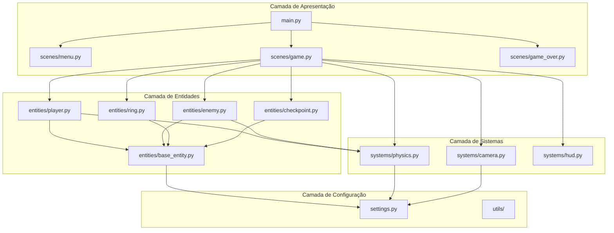
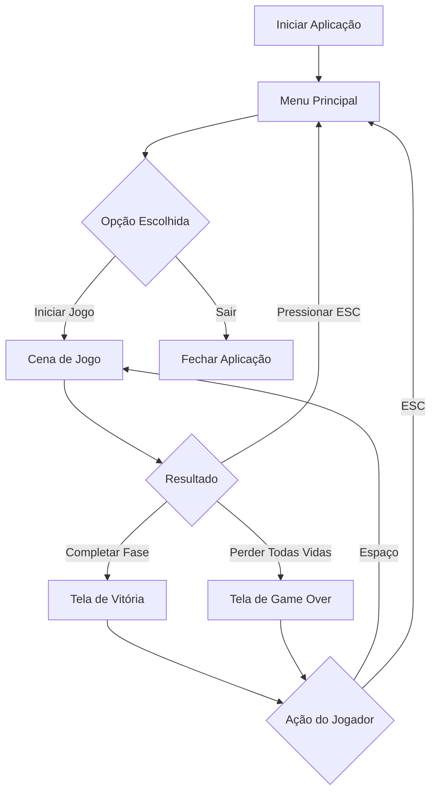
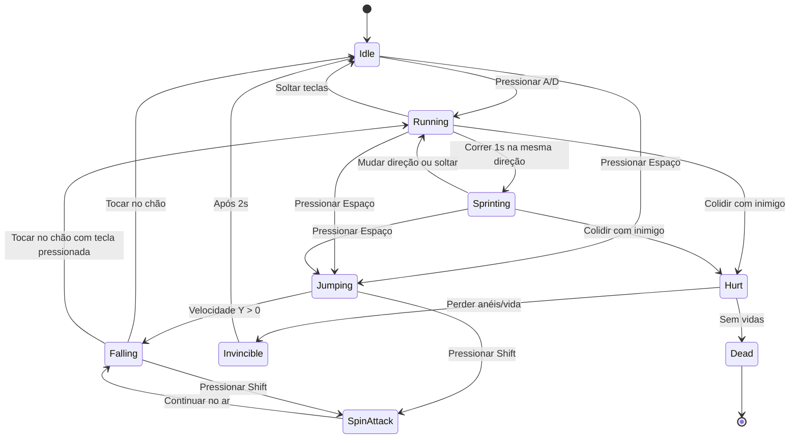

# PyBlaze

<div align="center">


</div>

Jogo de plataforma 2D de alta velocidade inspirado no Sonic the Hedgehog, desenvolvido em Python com pygame-ce.

## Características

- Personagem com movimento acelerado e mecânicas de alta velocidade
- Sistema de pulo variável (curto/longo baseado no tempo de pressão)
- Spin attack para destruir inimigos
- Sistema de anéis e vidas
- State machine completa do personagem
- **Sistema de sprites visuais** com animações e efeitos
- Fase jogável com 4 zonas:
  - Zona 1: Introdução com plataformas baixas
  - Zona 2: Rampa de aceleração e corredor de alta velocidade
  - Zona 3: Plataformas aéreas com abismos
  - Zona 4: Sprint final até a meta
- Checkpoints de respawn
- Câmera com suavização (lerp)
- HUD com contador de anéis, vidas e timer

## Requisitos

- Python 3.12+
- `uv` (gerenciador de pacotes)

## Instalação

### 1. Instalar o `uv`

**macOS / Linux:**
```bash
curl -LsSf https://astral.sh/uv/install.sh | sh
```

**Windows (PowerShell):**
```powershell
powershell -ExecutionPolicy ByPass -c "irm https://astral.sh/uv/install.ps1 | iex"
```

### 2. Clonar e instalar dependências

```bash
cd pyblaze
uv sync
```

## Como Jogar

### Executar o jogo

```bash
uv run python src/pyblaze/main.py
```

### Controles

**Menu:**
- `W/S` ou `Setas` - Navegar opções
- `Enter` ou `Espaço` - Selecionar

**Jogo:**
- `A/D` ou `Setas Esquerda/Direita` - Mover
- `Espaço` - Pular (segurar para pulo alto)
- `Shift Esquerdo` - Spin attack (no ar)
- `ESC` - Voltar ao menu

**Game Over / Vitória:**
- `Espaço` - Reiniciar fase
- `ESC` - Voltar ao menu

## Desenvolvimento

### Comandos Rápidos (Makefile)

O projeto inclui um Makefile com comandos de conveniência:

```bash
make help          # Mostra todos os comandos disponíveis
make install       # Instala dependências
make test          # Executa testes
make test-cov      # Testes com cobertura (relatório HTML)
make format        # Formata código automaticamente
make lint          # Verifica qualidade do código
make type-check    # Verifica tipos com mypy
make check         # Executa TODAS as verificações
make run           # Executa o jogo
make clean         # Remove arquivos temporários
make build-exe     # Cria executável standalone
make ci            # Simula pipeline de CI localmente
```

### Comandos Manuais

Se preferir executar os comandos diretamente:

#### Executar testes

```bash
uv run pytest -v
```

#### Verificar cobertura de testes

```bash
uv run pytest --cov=src/pyblaze --cov-report=html
```

#### Verificar tipos com mypy

```bash
uv run mypy src/
```

#### Formatar código

```bash
uv run ruff format src/ tests/
```

#### Lint com ruff

```bash
uv run ruff check src/ tests/ --fix
```

#### Executar todas as verificações

```bash
make check
# ou manualmente:
uv run ruff format src/ tests/ && uv run ruff check src/ tests/ --fix && uv run mypy src/ && uv run pytest
```

## Estrutura do Projeto

```
pyblaze/
├── .kiro/                     # Configurações e convenções do projeto
│   ├── specs/                # Especificações (O QUÊ fazer)
│   │   ├── prd.md           # Product Requirements Document
│   │   └── tech_spec.md     # Especificações técnicas
│   └── steering/            # Direcionamentos (COMO fazer)
│       ├── git_convention.md
│       ├── python_convention.md
│       ├── docker_convention.md
│       ├── documentation_convention.md
│       └── game_agent_convention.md
├── assets/                   # Assets visuais e sonoros
│   ├── sprites/             # Sprites das entidades
│   │   ├── player.png       # Spritesheet do player (4 frames)
│   │   ├── enemy.png        # Sprite do inimigo
│   │   ├── ring.png         # Sprite do anel
│   │   ├── checkpoint.png   # Checkpoint inativo
│   │   ├── checkpoint_active.png # Checkpoint ativo
│   │   ├── platform_tile.png # Tile de plataforma
│   │   └── procedural/      # Sprites procedurais (100+)
│   └── README.md            # Documentação dos assets
├── docs/                     # Documentação de referência
│   ├── INDEX.md             # Índice de toda documentação
│   ├── PROJETO_COMPLETO.md  # Visão geral completa
│   ├── QUICK_REFERENCE.md   # Comandos rápidos
│   ├── LESSONS_LEARNED.md   # Lições aprendidas
│   ├── SPRITE_GUIDE.md      # Guia de criação de sprites
│   ├── SPRITES_IMPLEMENTATION.md # Implementação do sistema de sprites
│   ├── SPRITES_SUMMARY.md   # Resumo do sistema de sprites
│   ├── PROCEDURAL_SPRITES.md # Sistema de sprites procedurais
│   └── CONTRIBUTING.md      # Guia de contribuição
├── tools/                    # Ferramentas de desenvolvimento
│   ├── generate_sprites.py  # Gerador de sprites básicos
│   ├── generate_advanced_sprites.py # Gerador de sprites avançados
│   ├── procedural_sprite_generator.py # Gerador procedural
│   ├── generate_all_sprites.py # Gera todos os sprites
│   ├── custom_masks.py      # Máscaras para sprites procedurais
│   ├── switch_sprites.py    # Alternador de sprites
│   ├── sprite_viewer.py     # Visualizador de sprites
│   └── create_player_spritesheet.py # Cria spritesheet do player
├── src/
│   └── pyblaze/
│       ├── entities/        # Entidades do jogo
│       │   ├── base_entity.py
│       │   ├── player.py
│       │   ├── enemy.py
│       │   ├── ring.py
│       │   └── checkpoint.py
│       ├── scenes/          # Cenas do jogo
│       │   ├── base_scene.py
│       │   ├── menu.py
│       │   ├── game.py
│       │   └── game_over.py
│       ├── systems/         # Sistemas de jogo
│       │   ├── physics.py
│       │   ├── camera.py
│       │   └── hud.py
│       ├── utils/           # Utilitários
│       │   ├── spritesheet.py
│       │   ├── audio.py
│       │   └── assets.py    # Gerenciador de sprites
│       ├── settings.py      # Constantes globais
│       └── main.py          # Entry point
└── tests/                   # Testes
    ├── conftest.py
    └── unit/
        ├── test_physics.py
        ├── test_player.py
        ├── test_camera.py
        ├── test_enemy.py
        └── test_ring.py
```

### Arquitetura de Módulos

O diagrama abaixo mostra a organização e relacionamento entre os módulos do projeto:



## Fluxo do Jogo

O diagrama abaixo ilustra o fluxo de navegação entre as diferentes cenas do jogo:



## Mecânicas de Jogo

### Estados do Personagem

O personagem possui uma state machine completa que gerencia seus diferentes estados:



### Sistema de Dano
- **Com anéis:** Jogador perde todos os anéis mas não perde vida
- **Sem anéis:** Jogador perde 1 vida e reaparece no último checkpoint
- **Sem vidas:** Game Over

### Velocidade
- **Corrida normal:** Velocidade base
- **Sprint:** Após 1 segundo correndo na mesma direção sem parar
- **Rampas:** Aumentam a velocidade automaticamente

### Inimigos
- Patrulham horizontalmente em suas plataformas
- Podem ser destruídos com spin attack vindo de cima
- Causam dano ao toque lateral ou frontal

## Build e Distribuição

### Criar Executável Standalone

Para distribuir o jogo sem necessidade de Python instalado:

```bash
# Usando Makefile
make build-exe

# Ou manualmente
python build/build.py
```

O executável será criado em `dist/PyBlaze.exe` (Windows) ou `dist/PyBlaze` (Linux/Mac).

### CI/CD com GitHub Actions

O projeto inclui pipeline automatizado que executa em cada push/PR:

- ✅ Verificação de formatação (Ruff)
- ✅ Linting (Ruff)
- ✅ Type checking (MyPy)
- ✅ Testes unitários (pytest)
- ✅ Cobertura de código (Codecov)
- ✅ Build em múltiplas plataformas

Ver configuração em [`.github/workflows/ci.yml`](.github/workflows/ci.yml)

## Licença

Este projeto foi desenvolvido como material educacional.

## Documentação

### Documentação de Referência

- **[docs/INDEX.md](docs/INDEX.md)** - Índice completo da documentação
- **[docs/PROJETO_COMPLETO.md](docs/PROJETO_COMPLETO.md)** - Resumo executivo e métricas
- **[docs/QUICK_REFERENCE.md](docs/QUICK_REFERENCE.md)** - Comandos rápidos
- **[docs/LESSONS_LEARNED.md](docs/LESSONS_LEARNED.md)** - Problemas encontrados e soluções
- **[docs/SPRITE_GUIDE.md](docs/SPRITE_GUIDE.md)** - Guia de criação de sprites
- **[docs/SPRITES_IMPLEMENTATION.md](docs/SPRITES_IMPLEMENTATION.md)** - Implementação do sistema de sprites
- **[docs/SPRITES_SUMMARY.md](docs/SPRITES_SUMMARY.md)** - Resumo do sistema de sprites
- **[docs/PROCEDURAL_SPRITES.md](docs/PROCEDURAL_SPRITES.md)** - Sistema de sprites procedurais
- **[docs/CONTRIBUTING.md](docs/CONTRIBUTING.md)** - Guia de contribuição
- **[CHANGELOG.md](CHANGELOG.md)** - Histórico de versões e mudanças

### Assets

- **[assets/README.md](assets/README.md)** - Documentação dos sprites e assets visuais

### Especificações e Convenções

- **[.kiro/specs/prd.md](.kiro/specs/prd.md)** - Product Requirements Document
- **[.kiro/specs/tech_spec.md](.kiro/specs/tech_spec.md)** - Especificações técnicas
- **[.kiro/steering/git_convention.md](.kiro/steering/git_convention.md)** - Convenções Git e GitHub CLI
- **[.kiro/steering/python_convention.md](.kiro/steering/python_convention.md)** - Padrões Python
- **[.kiro/steering/documentation_convention.md](.kiro/steering/documentation_convention.md)** - Guia de documentação

## Qualidade de Código

✅ **100% de conformidade com:**
- Type hints completos (mypy strict)
- Testes unitários (26 testes passando)
- Code quality (ruff + black)
- Logging estruturado (sem prints)
- Arquitetura modular

## Métricas do Projeto

- **Código:** ~1500 linhas
- **Testes:** 26 (100% passing)
- **Módulos:** 21
- **FPS:** 60 (estável)
- **Dependências runtime:** 1 (pygame-ce)
- **Tempo de fase:** 3-5 minutos

## Créditos

Desenvolvido seguindo as melhores práticas de Python moderno e documentado extensivamente para servir como referência educacional.
