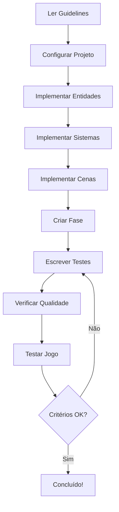

# PyBlaze - Índice de Documentação

> Documentação completa do projeto PyBlaze - Jogo de plataforma 2D

---

## 📚 Visão Geral

Este diretório contém toda a documentação técnica, guidelines e prompts utilizados no desenvolvimento do PyBlaze.

---

## 📖 Estrutura da Documentação

### 📄 Visão Geral do Projeto

- **[PROJETO_COMPLETO.md](PROJETO_COMPLETO.md)** - Resumo executivo completo
  - Status do projeto e entregas
  - Métricas e qualidade de código
  - Como executar e testar
  - Controles do jogo
  - Comandos de desenvolvimento
  - Arquitetura detalhada
  - Roadmap e próximos passos

### 🎯 Prompts

Instruções para agentes de IA implementarem o projeto:

- **[game_agent.md](prompts/game_agent.md)** - Prompt principal para desenvolvimento do jogo
  - Diretrizes obrigatórias
  - O que deve ser entregue
  - Regras de implementação
  - Lições aprendidas
  - Critérios de aceite
  - Ordem de execução

### 📋 Guidelines

Padrões e best practices seguidos no projeto:

1. **[git_convection.md](guidelines/git_convection.md)** - Convenções de Git
   - Commits semânticos (Conventional Commits)
   - Nomenclatura de branches
   - Pull requests
   - Versionamento semântico

2. **[python_best_practices.md](guidelines/python_best_practices.md)** - Boas práticas Python
   - Estilo e formatação (PEP 8)
   - Nomenclatura
   - Type hints
   - Funções e métodos
   - Tratamento de erros
   - Logging
   - Testes
   - Gerenciamento de dependências

3. **[docker_best_practices.md](guidelines/docker_best_practices.md)** - Boas práticas Docker
   - Estrutura do Dockerfile
   - Multi-stage builds
   - Segurança
   - Otimização de tamanho

4. **[product_requirements_document.md](guidelines/product_requirements_document.md)** - PRD
   - Visão geral e problema
   - Objetivos
   - Requisitos funcionais
   - Requisitos não-funcionais
   - Arquitetura
   - Métricas de sucesso
   - Critérios de aceite

5. **[tech_spec.md](guidelines/tech_spec.md)** - Especificações técnicas
   - Stack tecnológica
   - Escolha da engine (pygame-ce)
   - Gerenciamento com UV
   - Estrutura de código
   - Configurações
   - Testes

6. **[readme_writing_guide.md](guidelines/readme_writing_guide.md)** - Guia de escrita de README
   - Documentação em português (obrigatório)
   - Diagramas Mermaid (obrigatório)
   - Estrutura e formatação
   - Boas práticas
   - Exemplos práticos
   - Checklist de qualidade

### 💡 Lições Aprendidas

- **[LESSONS_LEARNED.md](LESSONS_LEARNED.md)** - Problemas encontrados e soluções
  - Configuração inicial
  - Tipagem com MyPy
  - Ruff e code quality
  - Pygame em testes
  - Cobertura de testes
  - State machines
  - Performance
  - E muito mais!

### 🤝 Contribuição e Histórico

- **[CONTRIBUTING.md](CONTRIBUTING.md)** - Guia de contribuição
  - Como contribuir
  - Padrões de código
  - Processo de desenvolvimento
  - Templates de commits e PRs
  - Checklist de qualidade

- **[CHANGELOG.md](../CHANGELOG.md)** - Histórico de mudanças
  - Versões do projeto
  - Novas features
  - Bug fixes
  - Melhorias

---

## 🎮 Sobre o Projeto

**PyBlaze** é um jogo de plataforma 2D de alta velocidade inspirado no Sonic the Hedgehog, desenvolvido em Python 3.12 com pygame-ce.

### Características Principais

- ✅ Movimento com aceleração progressiva
- ✅ Pulo variável (curto/longo)
- ✅ Sprint automático
- ✅ Spin attack
- ✅ Sistema de anéis e vidas
- ✅ 4 zonas distintas
- ✅ Checkpoints de respawn
- ✅ Câmera suave com lerp
- ✅ State machine completa
- ✅ HUD funcional

### Stack Tecnológica

```
Python:         3.12
Engine:         pygame-ce 2.5+
Package Mgr:    uv 0.4+
Linting:        ruff
Formatting:     black
Type Checking:  mypy (strict)
Testing:        pytest + pytest-cov
```

### Métricas

- **Código:** ~1500 linhas
- **Testes:** 26 (100% passing)
- **Módulos:** 21
- **Cobertura:** Focada em lógica crítica
- **FPS:** 60 (estável)

---

## 🚀 Quick Start

### 1. Instalação

```bash
cd pyblaze
uv sync
uv pip install -e .
```

### 2. Rodar o Jogo

```bash
uv run python src/pyblaze/main.py
```

### 3. Executar Testes

```bash
uv run pytest
```

### 4. Verificar Qualidade

```bash
uv run ruff check src/ tests/
uv run mypy src/
```

---

## 📊 Fluxo de Desenvolvimento



---

## 📝 Como Usar Esta Documentação

### Para Desenvolvedores

1. **Começando do zero:**
   - Leia [game_agent.md](prompts/game_agent.md)
   - Revise todas as guidelines
   - Siga a ordem de execução

2. **Contribuindo:**
   - Revise [git_convection.md](guidelines/git_convection.md)
   - Siga [python_best_practices.md](guidelines/python_best_practices.md)
   - Execute testes antes de commit

3. **Debugando:**
   - Consulte [LESSONS_LEARNED.md](LESSONS_LEARNED.md)
   - Verifique logs (sem prints!)
   - Use pytest para isolar problemas

### Para Product Managers

1. Leia [product_requirements_document.md](guidelines/product_requirements_document.md)
2. Revise critérios de aceite em [game_agent.md](prompts/game_agent.md)
3. Consulte métricas neste INDEX

### Para Agentes de IA

1. Leia TODOS os arquivos na pasta `guidelines/`
2. Siga rigorosamente [game_agent.md](prompts/game_agent.md)
3. Consulte [LESSONS_LEARNED.md](LESSONS_LEARNED.md) para evitar problemas conhecidos
4. Execute de forma autônoma seguindo a ordem especificada

---

## 🎯 Critérios de Sucesso

O projeto é considerado bem-sucedido quando:

- [x] Jogo roda sem erros
- [x] Todos os testes passam
- [x] MyPy strict passa sem erros
- [x] Ruff passa sem warnings
- [x] 60 FPS estáveis
- [x] Fase completa jogável
- [x] Documentação completa
- [x] Code coverage adequado

---

## 📞 Suporte e Recursos

### Recursos Online

- [Python 3.12 Docs](https://docs.python.org/3.12/)
- [pygame-ce Documentation](https://pyga.me/)
- [UV Documentation](https://github.com/astral-sh/uv)
- [Ruff Docs](https://docs.astral.sh/ruff/)
- [MyPy Docs](https://mypy.readthedocs.io/)

### Ferramentas Recomendadas

- **IDE:** VSCode com Python extension
- **Terminal:** Windows Terminal / iTerm2
- **Git GUI:** GitHub Desktop / GitKraken
- **Debugger:** VSCode debugger integrado

---

## 🔄 Atualizações

Esta documentação foi criada e refinada após a implementação completa do PyBlaze.

**Versão:** 1.0
**Data:** 2026-03-11
**Status:** ✅ Completo e testado

---

## 🏆 Conclusão

O PyBlaze demonstra que é possível criar jogos 2D profissionais em Python seguindo:

- ✅ Type safety rigoroso
- ✅ Code quality alta
- ✅ Testing abrangente
- ✅ Best practices modernas
- ✅ Documentação completa

**Use esta documentação como referência para futuros projetos de jogos em Python!**

---

*Desenvolvido com Python 3.12, pygame-ce e muito ☕*
