# Guideline: Como Escrever README.md

> Padrões e boas práticas para documentação de projetos em README.md

---

## 📋 Índice

1. [Princípios Fundamentais](#princípios-fundamentais)
2. [Estrutura Obrigatória](#estrutura-obrigatória)
3. [Idioma e Tom](#idioma-e-tom)
4. [Diagramas Mermaid](#diagramas-mermaid)
5. [Boas Práticas](#boas-práticas)
6. [Exemplos Práticos](#exemplos-práticos)
7. [Checklist Final](#checklist-final)

---

## 🎯 Princípios Fundamentais

### 1. **Documentação em Português**
- ✅ TODO o conteúdo deve estar em português brasileiro
- ✅ Termos técnicos podem ficar em inglês (ex: commit, merge, deploy)
- ✅ Nomes de tecnologias mantêm grafia original (ex: Python, Docker, pytest)
- ❌ Nunca misture idiomas em uma mesma seção

### 2. **Clareza e Objetividade**
- Seja direto ao ponto
- Use exemplos práticos
- Evite jargões desnecessários
- Assuma que o leitor tem conhecimento técnico básico

### 3. **Formato Visual**
- Use emojis com moderação para destacar seções
- Mantenha hierarquia clara com headings (H1 > H2 > H3)
- Use listas, blocos de código e tabelas quando apropriado

---

## 📐 Estrutura Obrigatória

Todo README.md deve conter, nesta ordem:

### 1. **Título e Descrição**
```markdown
# Nome do Projeto

Breve descrição (1-2 linhas) do que o projeto faz e qual tecnologia principal usa.
```

### 2. **Características Principais**
```markdown
## Características

- Lista das principais funcionalidades
- Use checkmarks (✅) para features implementadas
- Use símbolos de alerta (⚠️) para features em desenvolvimento
- Use cruz (❌) para features removidas/descontinuadas
```

### 3. **Requisitos**
```markdown
## Requisitos

- Versão do Python/Node/etc
- Ferramentas necessárias
- Dependências do sistema (se houver)
```

### 4. **Instalação**
```markdown
## Instalação

Passo a passo claro com comandos executáveis.
Inclua instalação de ferramentas base (uv, npm, etc).
```

### 5. **Como Usar**
```markdown
## Como Jogar / Como Executar / Como Usar

Comandos para executar a aplicação.
Se for um jogo, inclua controles.
Se for uma API, inclua exemplos de requisições.
```

### 6. **Desenvolvimento**
```markdown
## Desenvolvimento

Comandos para:
- Executar testes
- Verificar tipos
- Formatar código
- Lint
- Build
```

### 7. **Estrutura do Projeto**
```markdown
## Estrutura do Projeto

Árvore de diretórios com comentários explicativos.
Use diagramas Mermaid quando apropriado.
```

### 8. **Documentação Adicional**
```markdown
## Documentação

Links para documentação mais detalhada em docs/
```

### 9. **Licença e Créditos**
```markdown
## Licença

Tipo de licença ou nota sobre uso educacional.

## Créditos

Autores, colaboradores, inspirações.
```

---

## 🗣️ Idioma e Tom

### ✅ Fazer:
```markdown
## Como Executar

Para rodar o projeto, execute:

```bash
npm start
```

O servidor iniciará na porta 3000.
```

### ❌ Evitar:
```markdown
## How to Run

To run the project:

```bash
npm start
```

Server will start on port 3000.
```

### Tom de Voz
- **Imperativo:** "Execute o comando", "Instale as dependências"
- **Direto:** "O projeto usa Python 3.12", "Testes são obrigatórios"
- **Educativo:** "Este comando verifica tipos com mypy"
- **Profissional:** Evite gírias e informalidades excessivas

---

## 📊 Diagramas Mermaid

### Quando Usar Mermaid

Use diagramas Mermaid para visualizar:
- ✅ Fluxos de trabalho (workflows)
- ✅ Arquitetura do sistema
- ✅ Estrutura de dados
- ✅ Sequências de processos
- ✅ Estados e transições
- ✅ Relacionamentos entre módulos

### Tipos de Diagramas Recomendados

#### 1. **Fluxograma (Flowchart)**
Ideal para: processos, decisões, fluxos de trabalho

```markdown
## Fluxo de Desenvolvimento

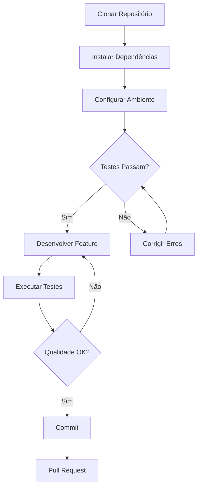
```

#### 2. **Diagrama de Sequência**
Ideal para: interações, comunicação entre componentes

```markdown
## Fluxo de Autenticação

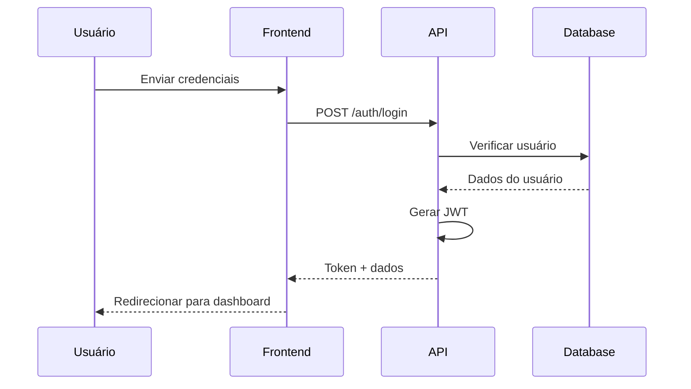
```

#### 3. **Diagrama de Estados**
Ideal para: state machines, ciclos de vida

```markdown
## Estados do Personagem

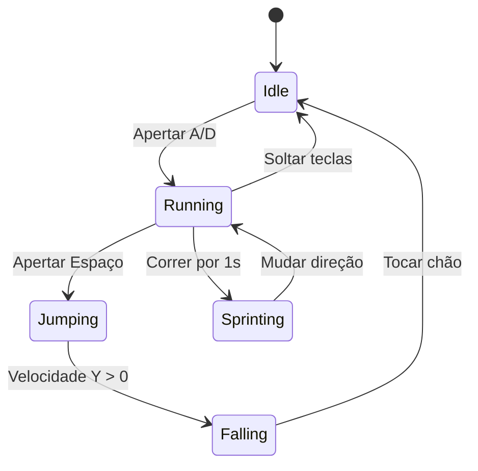
```

#### 4. **Diagrama de Classe**
Ideal para: arquitetura OOP, relacionamentos

```markdown
## Arquitetura de Entidades

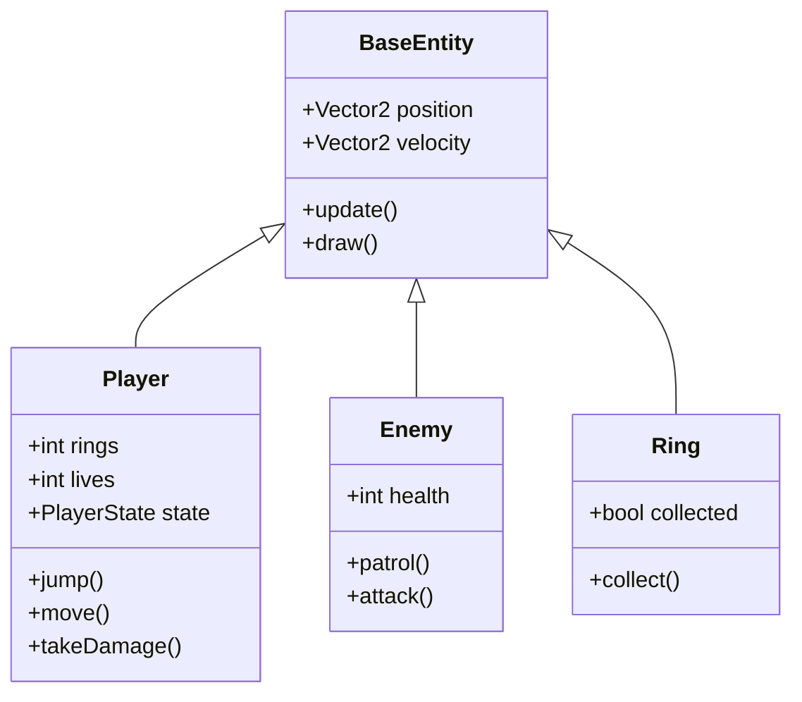
```

#### 5. **Gráfico (Graph)**
Ideal para: arquitetura de pastas, dependências

```markdown
## Estrutura do Projeto

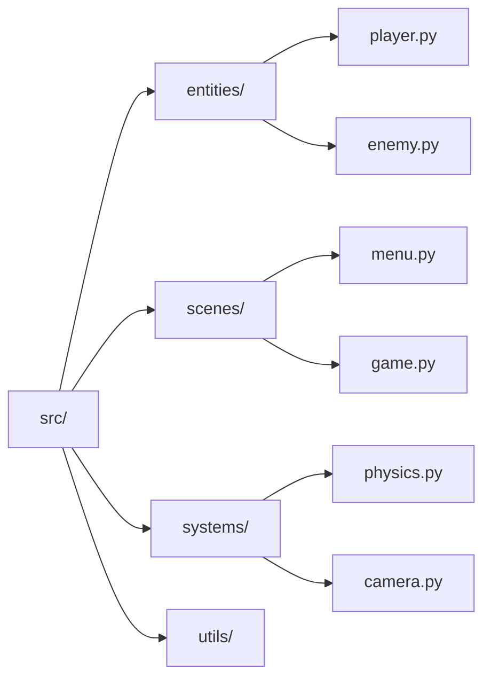
```

#### 6. **Timeline / Gantt**
Ideal para: roadmap, planejamento

```markdown
## Roadmap do Projeto

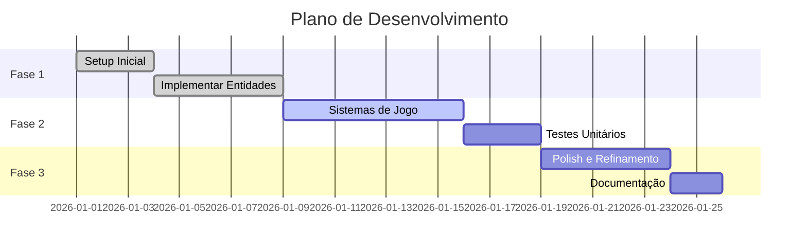
```

### Boas Práticas para Diagramas Mermaid

#### ✅ Fazer:

1. **Use Português nos Labels**
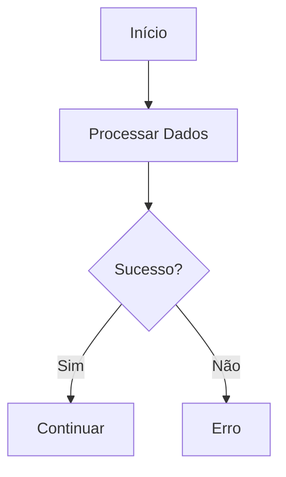

2. **Mantenha Simples e Legível**
- Máximo 10-15 nós por diagrama
- Se precisar de mais, divida em múltiplos diagramas

3. **Use Cores para Destacar**
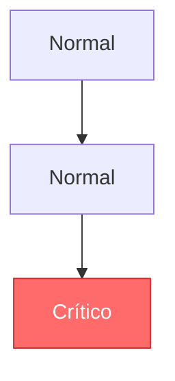

4. **Adicione Contexto Antes do Diagrama**
```markdown
## Fluxo de Autenticação

O diagrama abaixo mostra como o sistema processa um login de usuário:

```mermaid
...
```
```

#### ❌ Evitar:

1. **Diagramas Muito Complexos**
```mermaid
graph TD
    A --> B
    A --> C
    A --> D
    B --> E
    B --> F
    C --> G
    D --> H
    E --> I
    F --> J
    ... [20 mais nós]
```

2. **Misturar Idiomas**
```mermaid
graph TD
    A[Start] --> B[Processar]  ❌
```

3. **Falta de Contexto**
```markdown
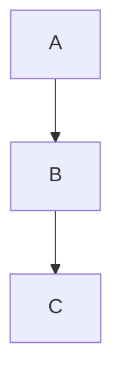
```
(Sem explicar o que A, B e C significam)

### Exemplos de Aplicação Real

#### Arquitetura do Sistema
```markdown
## Arquitetura

O projeto segue uma arquitetura em camadas:

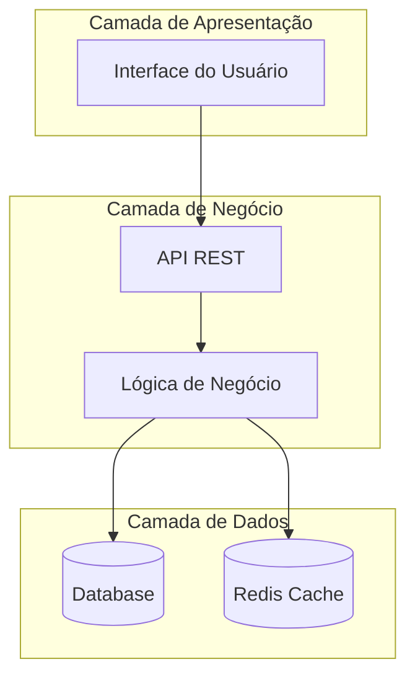
```

#### Pipeline CI/CD
```markdown
## Pipeline de Deploy

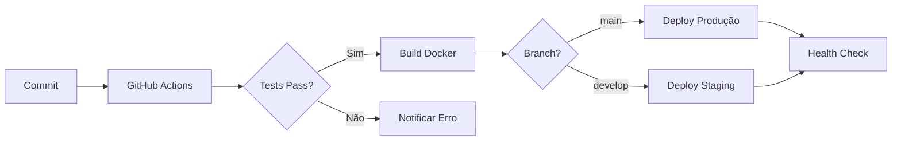
```

---

## ✨ Boas Práticas

### 1. **Blocos de Código Executáveis**
Sempre especifique a linguagem:

```markdown
```bash
npm install
```

```python
print("Hello, World!")
```

```javascript
console.log("Hello!");
```
```

### 2. **Badges (Opcional mas Recomendado)**
```markdown


```

### 3. **Tabelas para Comparações**
```markdown
## Comandos Principais

| Comando | Descrição | Quando Usar |
|---------|-----------|-------------|
| `npm test` | Executar testes | Antes de commit |
| `npm build` | Compilar projeto | Antes de deploy |
| `npm lint` | Verificar qualidade | Durante desenvolvimento |
```

### 4. **Seções Expansíveis (quando necessário)**
```markdown
<details>
<summary>Ver logs completos</summary>

```
[logs muito longos aqui]
```

</details>
```

### 5. **Links Internos**
```markdown
## Índice

1. [Instalação](#instalação)
2. [Uso](#uso)
3. [Desenvolvimento](#desenvolvimento)
```

### 6. **Alertas e Avisos**
```markdown
> ⚠️ **Atenção:** Este comando apaga todos os dados!

> 💡 **Dica:** Use `--verbose` para mais detalhes.

> 📝 **Nota:** Compatível apenas com Python 3.12+
```

---

## 📝 Exemplos Práticos

### Exemplo 1: README de Jogo

```markdown
# SpaceRunner

Jogo endless runner espacial desenvolvido em Python com pygame-ce.

## Características

- ✅ Geração procedural de obstáculos
- ✅ Sistema de power-ups
- ✅ Ranking local de pontuações
- ✅ Música e efeitos sonoros
- ⚠️ Multiplayer local (em desenvolvimento)

## Requisitos

- Python 3.12+
- uv 0.4+

## Instalação

```bash
# Instalar uv
curl -LsSf https://astral.sh/uv/install.sh | sh

# Clonar e instalar
git clone https://github.com/user/spacerunner.git
cd spacerunner
uv sync
```

## Como Jogar

```bash
uv run python src/main.py
```

### Controles

- `Espaço` - Pular
- `Seta Cima` - Usar power-up
- `ESC` - Pausar

## Estrutura do Jogo

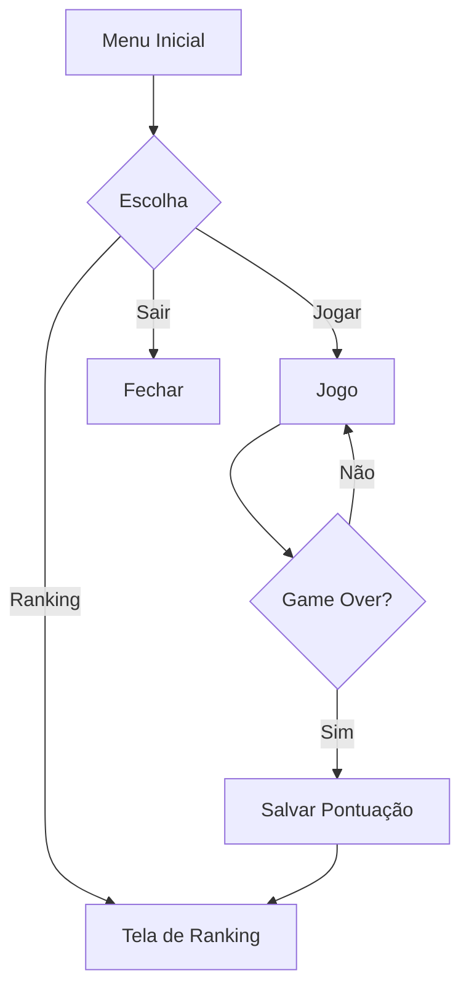

## Desenvolvimento

```bash
# Testes
uv run pytest

# Type checking
uv run mypy src/

# Lint
uv run ruff check src/ --fix
```

## Licença

MIT License - Uso educacional livre.
```

### Exemplo 2: README de API

```markdown
# TaskManager API

API RESTful para gerenciamento de tarefas com autenticação JWT.

## Características

- ✅ CRUD completo de tarefas
- ✅ Autenticação JWT
- ✅ Filtros e paginação
- ✅ Documentação Swagger
- ✅ Rate limiting

## Requisitos

- Python 3.12+
- PostgreSQL 15+
- Redis 7+ (para cache)

## Instalação

```bash
# Clonar repositório
git clone https://github.com/user/taskmanager-api.git
cd taskmanager-api

# Instalar dependências
uv sync

# Configurar ambiente
cp .env.example .env
# Edite .env com suas credenciais
```

## Como Usar

### Iniciar servidor

```bash
uv run uvicorn src.main:app --reload
```

### Endpoints Principais

| Método | Endpoint | Descrição | Auth |
|--------|----------|-----------|------|
| POST | `/auth/login` | Login de usuário | Não |
| GET | `/tasks` | Listar tarefas | Sim |
| POST | `/tasks` | Criar tarefa | Sim |
| PUT | `/tasks/{id}` | Atualizar tarefa | Sim |
| DELETE | `/tasks/{id}` | Deletar tarefa | Sim |

### Exemplo de Requisição

```bash
# Login
curl -X POST http://localhost:8000/auth/login \
  -H "Content-Type: application/json" \
  -d '{"email": "user@example.com", "password": "senha123"}'

# Criar tarefa
curl -X POST http://localhost:8000/tasks \
  -H "Authorization: Bearer {seu_token}" \
  -H "Content-Type: application/json" \
  -d '{"title": "Minha tarefa", "description": "Fazer algo"}'
```

## Arquitetura

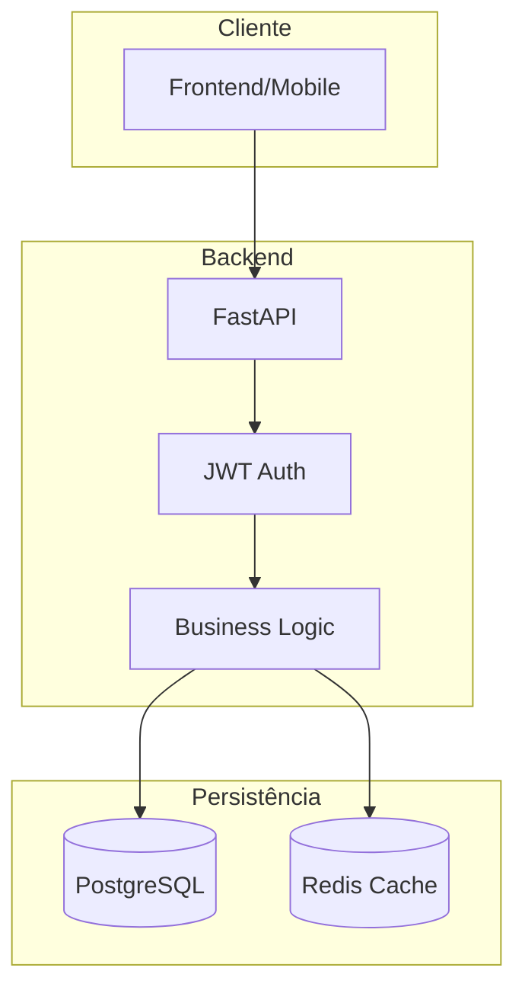

## Desenvolvimento

```bash
# Testes
uv run pytest --cov=src

# Migrações
uv run alembic upgrade head

# Documentação
# Acesse: http://localhost:8000/docs
```

## Documentação

- [API Docs (Swagger)](http://localhost:8000/docs)
- [Guia de Autenticação](docs/auth.md)
- [Modelos de Dados](docs/models.md)

## Licença

MIT License
```

---

## ✅ Checklist Final

Antes de finalizar seu README, verifique:

### Conteúdo
- [ ] Título claro e descritivo
- [ ] Descrição breve (1-2 linhas)
- [ ] Lista de características principais
- [ ] Requisitos claramente especificados
- [ ] Instruções de instalação passo a passo
- [ ] Instruções de uso/execução
- [ ] Seção de desenvolvimento com comandos
- [ ] Estrutura do projeto documentada
- [ ] Links para documentação adicional
- [ ] Licença especificada

### Idioma
- [ ] TODO conteúdo em português
- [ ] Tom profissional e educativo
- [ ] Termos técnicos mantidos corretamente

### Diagramas Mermaid
- [ ] Pelo menos 1 diagrama Mermaid relevante
- [ ] Diagramas em português
- [ ] Diagramas simples e legíveis (máx 15 nós)
- [ ] Contexto explicativo antes de cada diagrama
- [ ] Diagramas renderizam corretamente

### Formatação
- [ ] Hierarquia clara de headings (H1 > H2 > H3)
- [ ] Blocos de código com linguagem especificada
- [ ] Emojis usados com moderação
- [ ] Listas e tabelas bem formatadas
- [ ] Links internos funcionando
- [ ] Sem erros de markdown

### Qualidade
- [ ] Sem informações desatualizadas
- [ ] Comandos testados e funcionando
- [ ] Caminhos de arquivos corretos
- [ ] URLs válidas
- [ ] Sem typos ou erros gramaticais

---

## 🎯 Resumo

Um README.md de qualidade deve:

1. ✅ Estar **100% em português**
2. ✅ Conter pelo menos **1 diagrama Mermaid** relevante
3. ✅ Ter **estrutura clara e consistente**
4. ✅ Incluir **exemplos práticos executáveis**
5. ✅ Ser **objetivo e direto ao ponto**
6. ✅ Estar **atualizado** com o código
7. ✅ Ter **formatação impecável**

---

## 📚 Recursos Adicionais

- [Mermaid Official Docs](https://mermaid.js.org/)
- [GitHub Markdown Guide](https://guides.github.com/features/mastering-markdown/)
- [Shields.io (Badges)](https://shields.io/)
- [Emoji Cheat Sheet](https://github.com/ikatyang/emoji-cheat-sheet)

---

**Versão:** 1.0
**Data:** 2026-03-11
**Autor:** Desenvolvido seguindo best practices de documentação técnica
